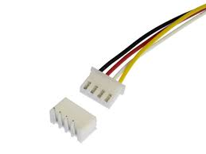
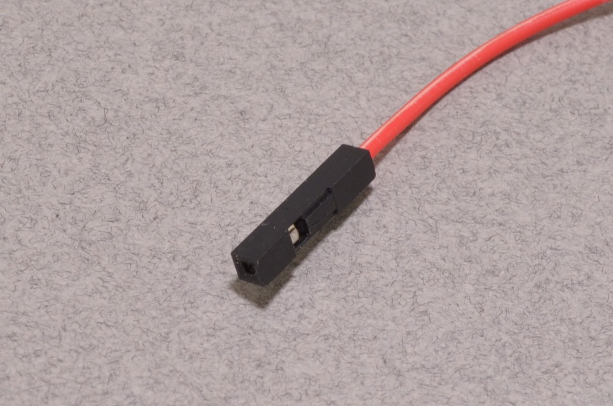
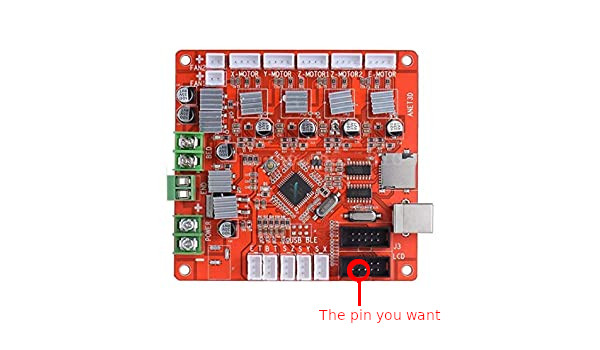

# Content

* Generic nomenclature
* Setup for SN04 sensor
* Setup for BLTouch sensor

### Generic nomenclature

Here I want to show you some generic information about the ANET A6 and the parts that come with it. Sometimes it can be 
useful to connect the things to a name.

Lets start with the JST connector. We gave the thing below that name. Or .. the company J.S.T. Mfg. Co came up with it.

Next up, we have the Dupont connector. You've seen it plenty of times.. and now you know the name.
Probably sometimes also called jump wires.

Now a more Anet A6 specific one. And we will need this information in a bit.. The pin layout of a sensor JST connector.
I believe that this pin layout is the same for all the sensor wires, but could be wrong in that. Anyhow, seen from top to bottom, we have
GND, VCC and then the signal from the sensor.

On your Anet A6 you can see a set of pins with `J3` next to it. Just for reference, this is what the pins represent:

For now, a last image of the LCD pin layout.. I marked one pin in particular. This is what is referd to as pin 27. We will need
this once we are going to install the BLTouch.

### Setup for SN04 sensor

This is the SN04 sensor, an inductive probe used for Automatic Bed Leveling (ABL) on 3d printers.

In this image you see it has no JST connection attached to the end. However, when I bought mine it already came with one.
So when you receive one without JST connection, you either need a new crimping tool or make use of a solder iron and some dupont connections.

Installing the hardware on your Anet A6 is, if it already has JST connectors, pretty easy. The only extra thing I needed was this mount [thingiverse](https://www.thingiverse.com/thing:2818370).

The changing needed to the software are really not that hard. The SN04 is a simple sensor, which only requires a specific Z-offset to be set. Setting
the optimal Z-offset is then again a standard process for which details can be found on other websites.

Note that the SN04 sensor can only detect ferromagnetic objects. Installing a glass bed (4mm thick) over your metalic printbed is not a possibility, the sensor is not sensitive enough to pick up the signal from the bed through the glass plate.

### Setup for BLTouch

This part will show you how to attach the BLTouch without any additional soldering, or crimping.

**You can only use this method if you do not use the LCD screen, and use Marlin 2.x.x **

([official website BLTouch](https://www.antclabs.com/bltouch))

"BLTouch is a type of semiconductor hall sensor and is an electronic component for 3D printers. 
BLTouch is an auto leveling sensor for 3D Printers that can precisely measure the tilt of Bed surface. It could work with any kinds of bed materials, such as glasses, woods, metals, and so on."

- from their website.

You can buy these things fairly easily from the internet. The place where I got them, also sold extension cables because the original one are too short to fit on the Anet A6.

Note that the left plugin will be put into the BLTouch, and the two right ones are meant for the ANet A6 motherboard. The three pins in the Dupont connector
are Signal (Yellow), VCC (Red), and GND (Brown). The JST connector has two wires, GND (Black) and Signal (White).

**For the Anet A6. The GND (Black) wire should be 'unplugged' from the JST connector, and put into the left input.**  

A close-up of the JST connector is set in the lower right corner. Here we clearly see that with this product, the GND (Black) wire is in the middle! Remember that this connector should be plugged in the Z_min spot on you Anet A6 board.
If we would plug it in as-is, then GND (Black) would be connected to the VCC pin of the Z_min slot!!
Details on how to re-wire a JST connector can be found online, the main idea is to have some small pin push on the metal ending if the connector. Then it just pops out.

Now we should have the right order for the JST connector. We only need to find the right spots for the wires on the Dupont connection. If we have no
LCD display, we have two sets of pins available to us: `J3` and `LCD`. From the `J3` pin-layout above, we already see where the GND (Brown) and VCC (Red) wire need to go.
The last wire, the signal (Yellow) one, needs to be put into Pin 27. We highlighted this in one of the images above. I still have no idea why this is Pin 27, but it works.

Next up comes the software changes. For BLTouch, the creators of Marlin added a line specific for the BLtouch that you need to uncomment. Now the printer knows which sensor we have. 
If you are using a Marlin versions below 2.x.x, then you need to assign a specific pin number to a variable. I dont know the details of this at the moment. But I do know that in Marlin 2.x.x this variable is already set in the pin configuration. 
So we are simply done at this point with the software and the wiring!

The last (or actually the first) thing you need to do, is [print this probe mount of the BLTouch](https://www.thingiverse.com/thing:2451350). Easy to install, and the producer already measured the probe-offsets there.

 

