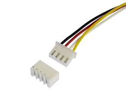
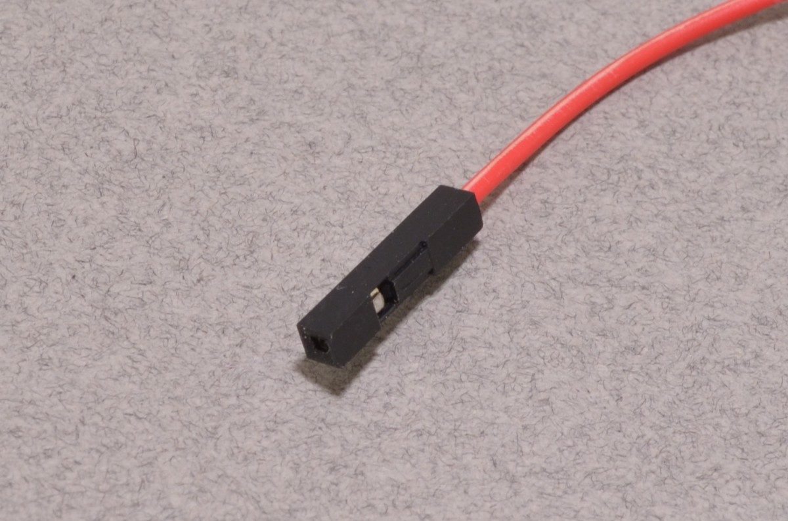
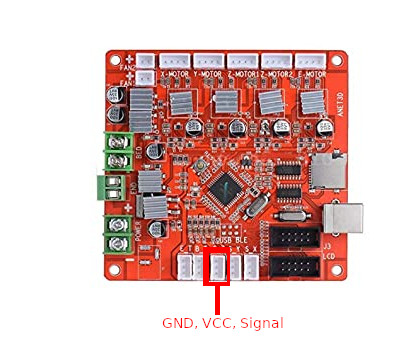
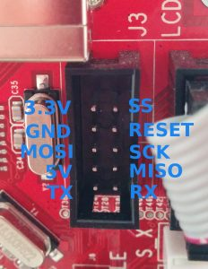
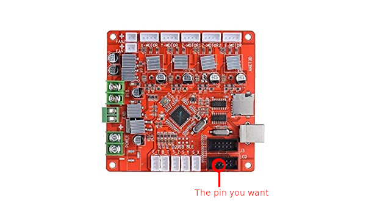

# Content

* Generic nomenclature
* Setup for SN04 sensor
* Setup for BLTouch sensor

### Generic nomenclature

Here I want to show you some generic information about the ANET A6 and the parts that come with it. Sometimes it can be 
useful to connect the things to a name.

Lets start with the JST connector. We gave the thing below that name. Or .. the company J.S.T. Mfg. Co came up with it.

Next up, we have the Dupont connector. You've seen it plenty of times.. and now you know the name.
Probably sometimes also called jump wires.

Now a more Anet A6 specific one. And we will need this information in a bit.. The pin layout of a sensor JST connector.
I believe that this pin layout is the same for all the sensor wires, but could be wrong in that. Anyhow, seen from top to bottom, we have
GND, VCC and then the signal from the sensor.

On your Anet A6 you can see a set of pins with `J3` next to it. Just for reference, this is what the pins represent:

For now, a last image of the LCD pin layout.. I marked one pin in particular. This is what is referd to as pin 27. We will need
this once we are going to install the BLTouch.

### Generic nomenclature